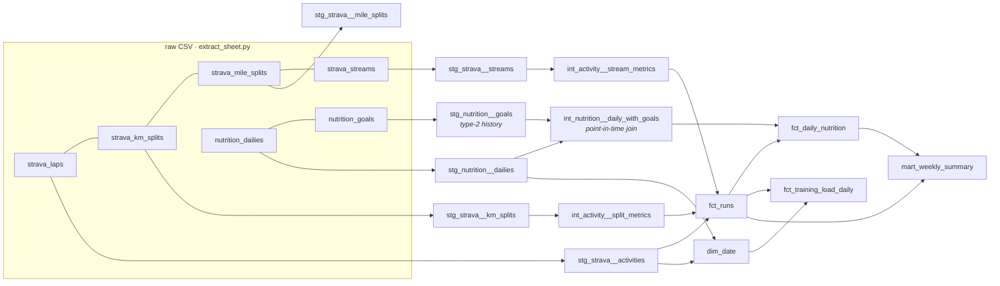

# run-analytics-dbt

[](https://github.com/trevorlomba/run-analytics-dbt/actions/workflows/dbt-ci.yml)

A dbt + DuckDB project that turns a personal training spreadsheet into tested,
documented analytics tables. It joins **Strava run data** (laps, splits, and
~33k second-by-second sensor samples) with a **daily nutrition log** and
**macro targets that change over time**.

The source is a real, messy Google Sheet. It has a repeated header row,
`#REF!` and `#VALUE!` formula errors, pace stored as text, heart rate missing for
most of the history, and a macro plan that changed mid-season. The project
cleans all of that in a staging layer and builds business-facing marts on top.

## Lineage



| Layer | Materialization | Purpose |
|---|---|---|
| `staging` | view | One model per source table: rename, cast, drop debris. No business logic. |
| `intermediate` | view | Reusable per-activity metrics and the point-in-time goals join. |
| `marts` | table | Grain-documented facts and a date dimension for BI. |

## Marts

- **`fct_runs`** (one row per run): distance, pace, elevation, HR, time in HR zones,
  pace variability, negative-split flag, and **aerobic decoupling** (efficiency drop
  from the first half to the second half of a run).
- **`fct_daily_nutrition`** (one row per day): intake vs. the macro targets *in force that day*,
  adherence flags, 3-day rolling averages, and a 4/4/9 macro-calorie sanity check.
- **`fct_training_load_daily`** (one row per day): 7-day acute load, 28-day chronic load,
  and the acute:chronic workload ratio.
- **`mart_weekly_summary`** (one row per ISO week): running volume next to nutrition adherence.
- **`dim_date`**: calendar with a `has_strava_coverage` flag (first to last synced run), so "no data" is never confused with "no runs". A stalled sync can't masquerade as a week of rest.

## Dashboard

`scripts/build_dashboard.py` renders a single-page dashboard from the marts:
weekly volume, training load, calories against the goal band, and a runs table.
It also reads dbt's own `target/run_results.json`, so the page opens with a
**data-health strip**: tests passed, warnings, and a plain-language line for each
warn-level monitor that fired.

**[Live demo on synthetic data](https://trevorlomba.github.io/run-analytics-dbt/)** (`docs/index.html`)

```bash
dbt build --vars '{raw_data_dir: data/sample}'
python scripts/build_dashboard.py --sample --standalone --out docs/index.html
```

## Design decisions

- **Everything lands as text.** Sources are read with `all_varchar = true`, and all
  typing happens in staging through a `clean_numeric` macro. Spreadsheet errors become nulls
  instead of failing the load.
- **Macro targets are a type-2 dimension.** The sheet stores old and current targets side
  by side in wide columns. `stg_nutrition__goals` unpivots them into validity windows, and
  days join to the targets that were active on that date. A **dbt unit test**
  (`goals_join_is_point_in_time`) pins that behavior, so changing targets never rewrites history.
- **Pace is recomputed** from time and distance instead of trusting the sheet's text column.
- **Stream samples are time-weighted.** Strava streams are not strictly 1 Hz, so zone time
  and average HR weight each sample by the gap to the next one.
- **Accidental starts are flagged, not deleted.** `is_valid_run` excludes activities under
  200 m from aggregates but keeps them for auditing.

## Tests

64 checks run on every `dbt build`:

- Grain tests (`unique`, `not_null`, and a custom `unique_combination`) on every model.
- Referential integrity (`relationships`) from splits and streams to activities.
- Plausibility ranges (custom `value_in_range`): pace between 2:00 and 20:00 per km, HR between 40 and 220 bpm.
- A custom `no_overlapping_windows` test on the goals history.
- Singular tests: km splits must sum to the activity distance (within 2%).
- **Warn-level data quality monitors:**
  - `warn_strava_sync_is_fresh` flags when runs stop arriving while food logging continues.
    It caught a real importer outage (no runs after 2026-09-14).
  - `warn_logged_calories_match_macros` flags days where logged calories differ from
    4/4/9 macro math by more than 15%, which usually means a logging slip.

## Run it

With the bundled **synthetic sample data** (no personal data needed):

```bash
python -m venv .venv && source .venv/bin/activate
pip install -r requirements.txt
dbt build --vars '{raw_data_dir: data/sample}'
dbt docs generate --vars '{raw_data_dir: data/sample}' && dbt docs serve
```

With a real export of the tracking sheet:

```bash
python scripts/extract_sheet.py path/to/export.xlsx   # writes data/raw/*.csv (git-ignored)
dbt build
```

`scripts/make_sample_data.py` generates `data/sample/` with a fixed seed. It reproduces
the real export's quirks (a repeated header row, `#REF!` cells, heart rate missing
before the monitor arrived, 0.5 Hz sampling), so every cleaning rule and test runs in CI.

## CI

GitHub Actions runs on every push and pull request:

1. Regenerate the sample data and fail if it differs from the committed copy.
2. `dbt build` all models and tests on the sample data.
3. `dbt docs generate`.
4. Build the dashboard from the sample marts.

## Stack

dbt-core 1.12 · dbt-duckdb · DuckDB · Python (openpyxl) · SQL
